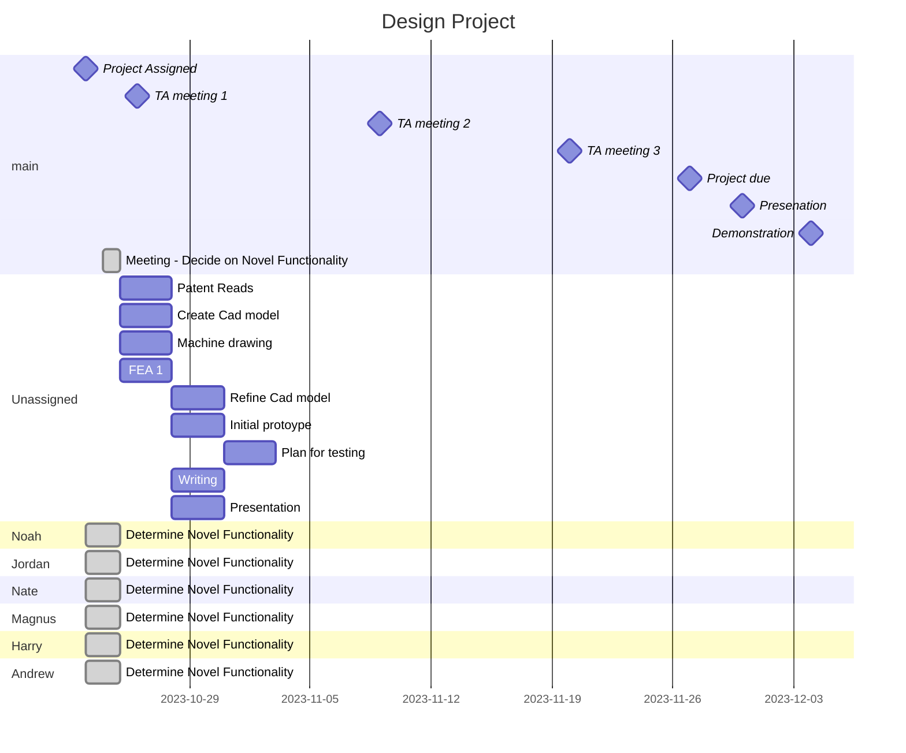

```mermaid
gantt
    title Design Project
    dateFormat  YYYY-MM-DD

    section main
    Project Assigned                        :milestone, 2023-10-23,0d
    TA meeting 1                            :milestone, 2023-10-26,0d
    TA meeting 2                            :milestone, 2023-11-09,0d
    TA meeting 3                            :milestone, 2023-11-20,0d
    Project due                             :milestone, 2023-11-27,0d
    Presenation                             :milestone, 2023-11-30,0d
    Demonstration                           :milestone, 2023-12-04,0d

    Meeting - Decide on Novel Functionality :done, m1,2023-10-24, 1d


    section Unassigned
    Patent Reads :after m1,3d
    Create Cad model : C1,after m1,3d
    Machine drawing : after m1,3d
    FEA 1 : after m1, 3d
    Refine Cad model : after C1, 3d
    Initial protoype : p1,after C1,3d
    Plan for testing : after p1, 3d
    Writing : after C1, 3d
    Presentation : after C1, 3d

    section Noah
    Determine Novel Functionality           :done,2023-10-23, 2d
    section Jordan
    Determine Novel Functionality           :done,2023-10-23, 2d
    section Nate
    Determine Novel Functionality           :done,2023-10-23, 2d
    section Magnus
    Determine Novel Functionality           :done,2023-10-23, 2d
    section Harry
    Determine Novel Functionality           :done,2023-10-23, 2d
    section Andrew
    Determine Novel Functionality           :done,2023-10-23, 2d

```
